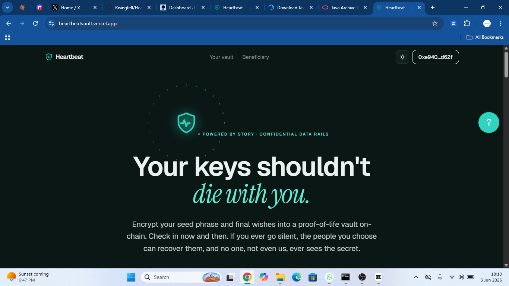
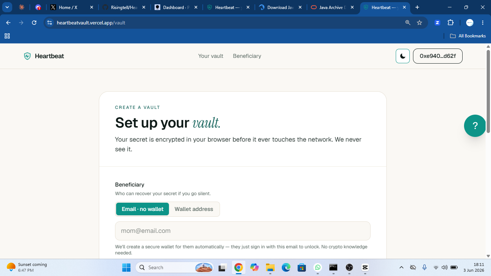
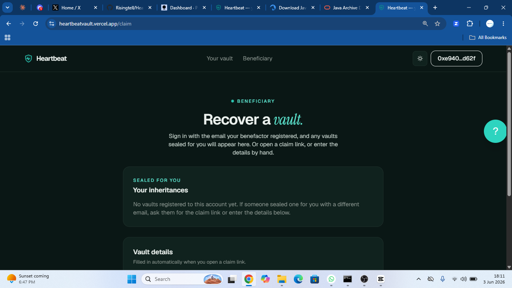

<div align="center">

# ♥ Heartbeat

### Your keys shouldn't die with you.

A proof-of-life vault for crypto inheritance, built on Story's [Confidential Data Rails](https://www.story.foundation/blog/confidential-data-rails).

[](https://heartbeatvault.vercel.app)
[](https://youtu.be/l2uqY6XOMsl)
[](https://aeneid.storyscan.io)
[](https://nextjs.org)
[](#license)

[Live demo](https://heartbeatvault.vercel.app) · [Demo video](https://youtu.be/l2uqY6XOMsl) · [Submission for the CDR Hackathon](https://build.usecdr.dev)

<br />


</div>

---

## Contents

- [What it is](#what-it-is)
- [What it looks like](#what-it-looks-like)
- [How it works](#how-it-works)
- [Why CDR](#why-cdr)
- [The `DeadManSwitch` contract](#the-deadmanswitch-contract)
- [Security model](#security-model)
- [Tech stack](#tech-stack)
- [Run it locally](#run-it-locally)
- [Tests](#tests)
- [Roadmap and known limitations](#roadmap-and-known-limitations)
- [Built by](#built-by)
- [License](#license)

---

## What it is

Billions in crypto are lost forever because seed phrases vanish with their owners. You can't put a seed phrase in a will (probate is public), you can't trust a lawyer with it, and a hardware wallet in a drawer is useless if no one knows the PIN. Writing it down gives access now, to whoever finds the paper.

Heartbeat fixes this with three properties:

- **Sealed while you're alive.** Your seed phrase is encrypted in the browser before it ever touches the network. The vault stays locked to *everyone*, including your heirs, while you keep checking in.
- **Released when you go silent.** A single click is your heartbeat. If you stop checking in past a window you set, the people you chose can recover the secret. No lawyer, no custodian, no middleman.
- **Anyone can be a beneficiary.** Heirs claim by signing in with email or Google. A wallet is created and gas-funded for them automatically. Once they're signed in, a vault sealed for them shows up in an inheritance inbox without needing a claim link.

## What it looks like

> Screenshots live in [`public/screenshots/`](public/screenshots). To populate them, see the [capture guide there](public/screenshots/README.md).

<table>
  <tr>
    <td width="50%" align="center">
      
      <br /><em>Landing page</em>
    </td>
    <td width="50%" align="center">
      
      <br /><em>Setting up a vault</em>
    </td>
  </tr>
  <tr>
    <td width="50%" align="center">
      
      <br /><em>Owner dashboard with proof-of-life status</em>
    </td>
    <td width="50%" align="center">
      
      <br /><em>Beneficiary inheritance inbox</em>
    </td>
  </tr>
  <tr>
    <td colspan="2" align="center">
      
      <br /><em>The recovered secret reveal</em>
    </td>
  </tr>
</table>

## How it works

```
Owner   ─ encrypt(seed) in browser ─▶  CDR vault   (gated by DeadManSwitch)
  │                                       ▲
  └─ heartbeat() ─ proof of life ─────────┘    alive → reads revert
                                                silent → validator TEEs
Heir    ─ sign in (email) ─▶ accessCDR ─────▶ threshold decrypt ─▶ secret
```

1. **Seal.** The owner writes their seed phrase + a short final message in the browser. The CDR SDK encrypts it locally with the validator network's DKG public key (TDH2 threshold encryption). The ciphertext is written to an on-chain vault on Story Aeneid.
2. **Heartbeat.** A single click on the dashboard calls `heartbeat()` on the `DeadManSwitch` contract, resetting the proof-of-life clock. One heartbeat covers every vault the owner has sealed.
3. **Inactivity.** If the owner stops checking in past the period they set, the on-chain condition flips and the heir can read. Optional guardians can also attest inactivity (M-of-N), with a challenge window the owner can cancel.
4. **Claim.** The heir signs in with email or Google. Heartbeat creates and gas-funds an embedded wallet for them, registers the (vault, owner, period) on their Privy user, and the vault shows up in their inheritance inbox. They click open, click unlock, and the validator TEEs release their partial decryptions only if the condition passes. The browser combines them and the plaintext appears, only on the heir screen, only at that moment.

## Why CDR

Heartbeat is CDR-native, not a thin wrapper. CDR is the only primitive that makes "release this exact data, only after this on-chain condition is met, only to this specific caller, with no custodian" possible. We don't think the project could have been built any other way.

This README builds on the canonical [`01-encrypt-text.ts`](https://github.com/jacob-tucker/cdr-skill/blob/main/src/01-encrypt-text.ts) pattern from `jacob-tucker/cdr-skill` (`OwnerWriteCondition` for write, threshold encryption via the CDR SDK), extended with a custom `DeadManSwitch` condition contract on top so the read side opens to a named beneficiary on a proof-of-life timer instead of always pointing at the original owner.

## The `DeadManSwitch` contract

A single Solidity contract acts as both the read and write gate for every vault. See [`contracts/DeadManSwitch.sol`](contracts/DeadManSwitch.sol).

- **Per-vault binding.** Each vault's `conditionData` is `abi.encode(owner, heir, period)`. One owner can seal many vaults to different heirs with different windows. Re-sealing never affects existing vaults.
- **Time-based release.** The heir can decrypt once `block.timestamp >= lastPing + period`.
- **One heartbeat for everything.** `heartbeat()` resets the single proof-of-life clock and effectively re-seals every vault at once.
- **Guardian multi-sig.** An optional M-of-N quorum can attest inactivity to release early, behind a challenge window the owner can cancel. Guardians can be added or removed by reconfiguring.
- **`accessAuxData` rejection.** The gate decodes the vault tuple only from `conditionData` and refuses any access that supplies a non-empty `accessAuxData`. This closes an argument-confusion vector.
- **Composable.** Any contract can read `isClaimable(owner, period)`, `secondsUntilClaimable(owner, period)`, or `getClock(owner)`.

### On the CDR interface

The live Aeneid CDR core invokes condition contracts as `check{Read,Write}Condition(uint32 uuid, bytes, bytes, address caller)` — selectors `0x8db3eb17` / `0x5645dbbf`, matching the deployed `LicenseReadCondition` / `OwnerWriteCondition`. Story's published docs show a 3-arg `(address, bytes, bytes)` shape, which is stale relative to what's actually deployed. We reverse-engineered the live interface from the bytecode of the deployed conditions and matched it (see [`scripts/find-sig2.mts`](scripts/find-sig2.mts)). The SDK probe and the precompile call use different signatures, which is why every custom condition contract needs `skipConditionValidation: true` to allocate.

## Security model

Access is enforced cryptographically, in three layers:

1. **UI** hides the unlock button for non-beneficiaries. This is convenience only.
2. **On-chain condition.** The CDR core calls `checkReadCondition` and a non-heir, or a too-early read, reverts with `CDR: Read condition not met`.
3. **Threshold TEEs.** The secret is split across the validator network. Nothing reassembles until the on-chain condition passes, so there is nothing to brute-force.

Only metadata (that a vault exists, the heir address, the period) is public. The contents never are.

> **Testnet caveat:** CDR's confidentiality on the Aeneid testnet is not production-hardened. Don't seal a real, funded seed phrase here. Use a throwaway secret for the demo.

## Tech stack

| Layer | Choice |
|---|---|
| Framework | Next.js 16 (App Router) + React 19 + TypeScript |
| Styling | Tailwind v4 + Instrument Serif display font |
| Themes | `next-themes` with hand-tuned light + dark palettes |
| Smart contracts | Solidity `^0.8.19`, deployed to Story Aeneid (chain 1315) |
| CDR | `@piplabs/cdr-sdk` for client-side threshold encryption |
| Wallets | Privy embedded wallets (email, Google, passkey) + injected wallets |
| Web3 | viem + wagmi (via `@privy-io/wagmi`) |
| Tests | Foundry for the contract, end-to-end TypeScript scripts for the live flow |

A same-origin proxy at `/api/cdr/*` bridges CDR's HTTP REST endpoint so the app works over HTTPS without mixed content.

## Run it locally

```bash
git clone https://github.com/Risingtell/Heartbeat.git
cd Heartbeat
npm install --legacy-peer-deps   # Privy / wagmi peer ranges
cp .env.example .env             # fill in the values below
npm run dev                      # http://localhost:3000
```

### Environment variables

| Var | Purpose |
|---|---|
| `NEXT_PUBLIC_PRIVY_APP_ID` | Privy app id (public, ships in client bundle) |
| `PRIVY_APP_SECRET` | Privy server SDK, used to pre-provision heir wallets and register inheritances |
| `RELAYER_PRIVATE_KEY` | Testnet key that gas-funds new embedded wallets so the heir can unlock without buying IP |
| `CDR_API_URL` | CDR Story-API REST base (proxied through `/api/cdr`) |

### Helper scripts (against the live testnet)

```bash
npm run smoke                            # CDR uploadCDR + accessCDR round-trip
npx tsx scripts/dms-flow.mts             # full owner-seals + heir-claims flow
npx tsx scripts/deploy.mts \
  contracts/DeadManSwitch.sol DeadManSwitch  # compile + deploy
```

The deployed contract address lives in [`deployments.json`](deployments.json) and [`src/lib/contract.ts`](src/lib/contract.ts). Both must be updated together after a redeploy.

## Tests

```bash
forge test
```

Eleven Foundry tests in [`test/DeadManSwitch.t.sol`](test/DeadManSwitch.t.sol) cover the state machine: time release, heartbeat reset, guardian quorum, challenge window, guardian removal, per-vault independence, and rejection of non-heir / write / malformed-data access. No `forge-std` submodule needed.

The live threshold-decrypt path isn't part of CI. Use `scripts/dms-flow.mts` after redeployment to verify it against the deployed contract.

> `demoExpire()` is shipped in the production contract for live demonstrations. It only fast-forwards the caller's own clock, so it's self-only and harmless. Remove it before any production deployment.

## Roadmap and known limitations

These are honest. Some are simple "we ran out of hackathon hours," some are harder design questions worth thinking about.

- **Mobile claim flow** is currently broken. Privy popup semantics and our CDR WASM path both need mobile-specific testing. Desktop browsers only, for now.
- **Beneficiary identity over 10–30 years.** The current design assumes the heir keeps the email account they signed in with. If they lose access to it, recovery fails. Adding a fallback wallet address as an "OR" condition would help.
- **Minor beneficiaries.** No special handling today. The right answer is a custodian or guardian quorum, optionally with an age-based time lock layered on top of the dead-man trigger.
- **No durable vault discovery for old vaults.** The inheritance inbox only registers vaults sealed after the registration feature shipped. Vaults sealed before that need the claim link or manual entry.
- **Owner wallet loss is catastrophic.** If you lose the wallet that sealed the vault, you can't `heartbeat()` and you can't reconfigure. The vault releases as scheduled, but the loss of control is a real risk.

## Built by

[Rising Technology](https://www.linkedin.com/company/risingtechnology). Solo build by [@Risingtell](https://github.com/Risingtell), with code review and contributions from [@Ridwannurudeen](https://github.com/Ridwannurudeen) via PRs that added per-vault binding, the security fixes, the Foundry test suite, the rate limit, the brand mark, and the CDR flow diagram.

Built for the [Story Foundation CDR Hackathon](https://build.usecdr.dev).

## License

MIT. See [`LICENSE`](LICENSE) if present, otherwise consider the code MIT-licensed for the duration of the hackathon and treat the contents as open source.
